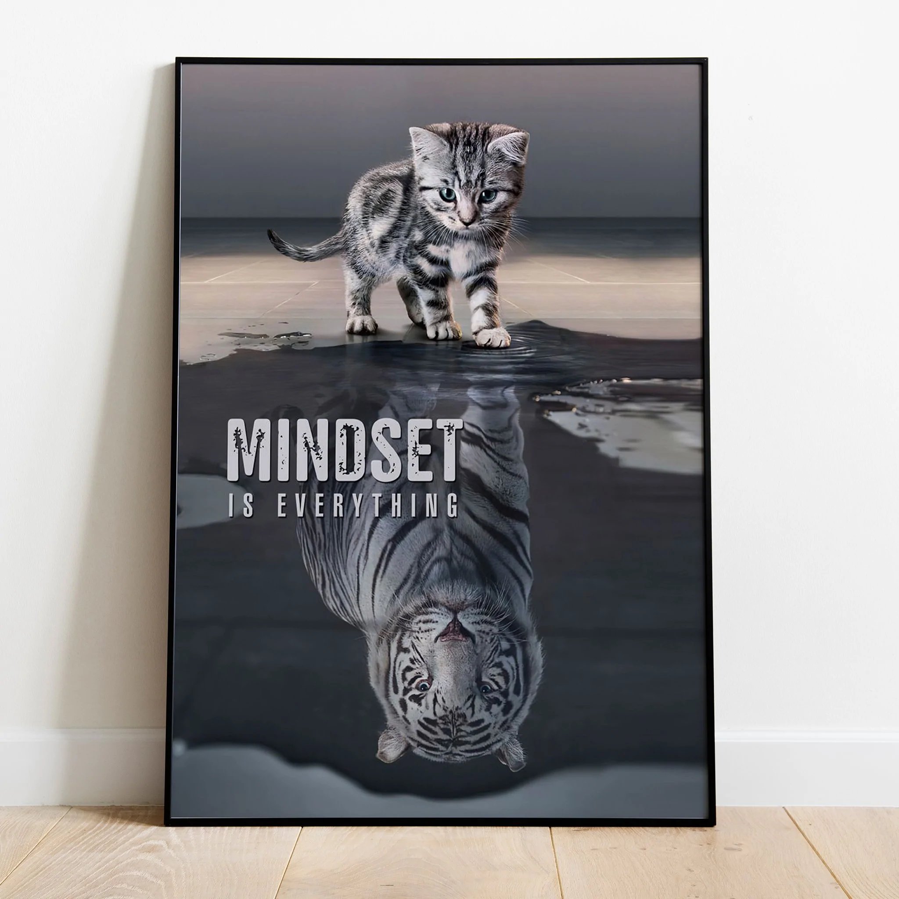

Starter Kit for Data Science (R and Python)

# Before Start to Learn
**Mindset is everything** because our mindset will be the guiding force behind our decisions and the actions we have to take.

You must believe that **you can do it, you can learn data science as well!**

  

# What is Programming?
Before we dive deeper, let's watch this video!

<iframe width="560" height="315" src="https://www.youtube.com/embed/dU1xS07N-FA" title="YouTube video player" frameborder="0" allow="accelerometer; autoplay; clipboard-write; encrypted-media; gyroscope; picture-in-picture" allowfullscreen></iframe>

Programming means writing instructions for a computer to perform desired actions or tasks. 

For writing instruction, we need a language, as humans talk to each other. Because of the computer can't understand our natural language—such as English, Bahasa Indonesia—we need to communicate with the computer using a language that the computer understands, **programming language**. 

A programming language is a set of commands, instructions, and other syntax use to create a software program. The problem that programming languages solve is computers only understand 0s and 1s, but humans do not understand 0s and 1s. So, a programming language is an intermediary between a computer and a programmer.

There are hundreds of developing programming languages with various uses. The majority of popular programming languages are high-level languages (which are easy for humans to understand). Some of them, namely **Python and R**. We will learn more in [**Algoritma Data Science School**](https://algorit.ma/) course. 

However, here we will provide a little starter for those of you who want to start learning both languages for free and can be accessed life-time. Please enjoy while studying!

# R

References:
- https://algorit.ma/blog/belajar-bahasa-pemrograman-r-rstudio/

# Python

References: 
- https://algorit.ma/blog/belajar-bahasa-pemrograman-python/