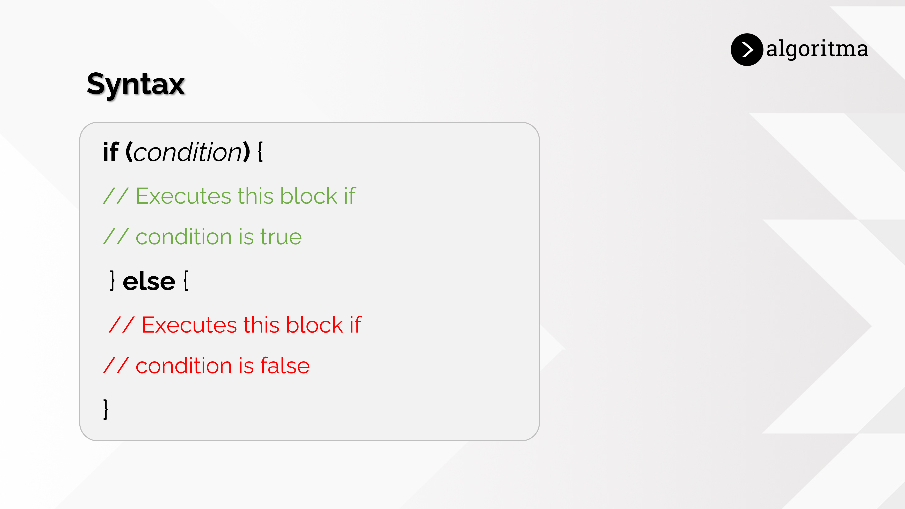

# Starter Kit for Data Science (R and Python)

#### Created by [Algoritma Data Science School](https://algorit.ma)

For better experience to read, you can visit on [this link.](https://rpubs.com/finesaaa/algoritma-starter-kit-ds)

# 🙌 Before Start to Learn

**Mindset is everything** because our mindset will be the guiding force behind our decisions and the actions we have to take.

You must believe that **you can do it, you can learn data science as well!**


# 💻 What is Programming?

Before we dive deeper, let's watch this video!

[](https://www.youtube.com/watch?v=dU1xS07N-FA)

Programming means writing instructions for a computer to perform desired actions or tasks.

For writing instruction, we need a language, as humans talk to each other. Because of the computer can't understand our natural language---such as English, Bahasa Indonesia---we need to communicate with the computer using a language that the computer understands, **programming language**.

## Programming Language

A programming language is a set of commands, instructions, and other syntax use to create a software program. The problem that programming languages solve is computers only understand 0s and 1s, but humans do not understand 0s and 1s. So, a programming language is an intermediary between a computer and a programmer.

There are hundreds of developing programming languages with various uses. The majority of popular programming languages are high-level languages (which are easy for humans to understand). Some of them, namely **Python and R**. We will learn more in [**Algoritma Data Science School**](https://algorit.ma/) course.

### R

R is the name of a programming language as well as software for data processing and graphics. R is very popular today for three reasons:

-   Lots of data processing options with a very complete number of features from graphics to machine learning.

-   It is faster to learn and run to process data compared to other languages.

-   R is free and open source, which means there is no need for licensing fees which are usually very expensive for data processing software.

> 📌 They have many [Cheatsheets](https://www.rstudio.com/resources/cheatsheets/) for you

### Python

Python is widely used in data science and has a robust suite of powerful tools to communicate with data. Python is also popular today for three reasons:

-   Python is easy to learn.

-   The syntax is easy to read and understand.

-   There are many useful libraries to perform computations and other operations.

> 📌 Generally, Python code is also much shorter compared to other programming languages.

However, here we will provide a little starter for those of you who want to start learning both languages for free and can be accessed life-time. Please enjoy while studying!

# 🔍 Basic Programming

## Variable

A variable is a place to store data, while a data type is a type of data stored in a variable.


So if we say, data is food, then variable is where we store the food.

**R**

Use the assignment operator `<-` to create new variables.

``` r
x <- 5
x
```

    ## [1] 5

**Python**

Use the assignment operator `=` to create new variables.

``` python
print("Hello Python!")
```

    ## Hello Python!

``` python
x = 5
x
```

    ## 5

## If-Else Statement

This is one of the Decision-making statements in the programming language. It is one of the easiest decision-making statements.



**R**

``` r
x <- 5
if (x > 0) {
  print('x is positive')
} else {
  print('x is negative')
}
```

    ## [1] "x is positive"

``` r
print('This cell execute after if-else statement')
```

    ## [1] "This cell execute after if-else statement"

**Python**

``` python
x = -5
if (x > 0):
  print('x is positive')
else:
  print('x is negative')
```

    ## x is negative

``` python
print('This cell execute after if-else statement')
```

    ## This cell execute after if-else statement

## Vector (R) / List (Python)

This vector in R is a place to store values for elements that have the same class. But, if we want to store elements or components that have different classes and lengths, we can use **list** both in R or Python.

**R**

In R, if we want to store elements or components that have different classes and lengths, we can use `list`, but if the classes of the element that we want to store is same, instead of `list()` we can use **concate** function or `c()` or we can call it as vector.


*Vector*

``` r
my_vector <- c("a", "b", "c") 
print(my_vector)
```

    ## [1] "a" "b" "c"

*List*

``` r
my_list <- list("apple", 1, "cherry", my_vector)
my_list[1]
```

    ## [[1]]
    ## [1] "apple"

``` r
my_list[length(my_list)] # That means printing the last element
```

    ## [[1]]
    ## [1] "a" "b" "c"

``` r
my_list[-1] # That means excluding the first element to print
```

    ## [[1]]
    ## [1] 1
    ## 
    ## [[2]]
    ## [1] "cherry"
    ## 
    ## [[3]]
    ## [1] "a" "b" "c"

**Python**

List in Python can be used for storing elements or components that have different classes and lengths. Python uses **zero-based indexing**. That means, the first element(value 'red') has an index 0, the second(value 'green') has index 1, and so on. **Negative indexing** in Python means the indexing starts from the end of the iterable.


``` python
my_list = ["apple", 1, "cherry", ["a", "b", "c"]]
my_list[0]
```

    ## 'apple'

``` python
my_list[-1] # That means printing the last element
```

    ## ['a', 'b', 'c']

``` python
my_list[1:] # That means excluding the first element to print
```

    ## [1, 'cherry', ['a', 'b', 'c']]

## Loop (For)

The for loop is used to iterate over a sequence (list) or other iterable objects.


**R**

``` r
for (i in c("apple", "banana", "cherry"))
{
    print(i)
}
```

    ## [1] "apple"
    ## [1] "banana"
    ## [1] "cherry"

*Using `list()`*

``` r
for (i in list("apple", 1, "cherry"))
{
    print(i)
}
```

    ## [1] "apple"
    ## [1] 1
    ## [1] "cherry"

**Python**

``` python
my_list = ["apple", 1, "cherry"]
for i in my_list:
  print(i)
```

    ## apple
    ## 1
    ## cherry

## DataFrame

DataFrame is a **data structure that organizes data into a 2-dimensional table of rows and columns**, much like a spreadsheet.


### Create a DataFrame

**R**

For creating a DataFrame in R, we can `use data.frame()`

``` r
iklan <- data.frame(Channel=c("Youtube", "Instagram", "Facebook", "Twitter"), budget=c(8.0, 4.5, 4.3, 2.5))
iklan
```

    ##     Channel budget
    ## 1   Youtube    8.0
    ## 2 Instagram    4.5
    ## 3  Facebook    4.3
    ## 4   Twitter    2.5

**Python**

For creating a DataFrame in Python, we need `pandas` library. So first of all we need import that library like this one.

``` python
import pandas as pd
```

``` python
iklan = pd.DataFrame({
  "Channel":["Youtube", "Instagram", "Facebook", "Twitter"],
  "budget":[8.0, 4.5, 4.3, 2.5],})
print(iklan)
```

    ##      Channel  budget
    ## 0    Youtube     8.0
    ## 1  Instagram     4.5
    ## 2   Facebook     4.3
    ## 3    Twitter     2.5

### Get the Structure

**R**

One can get the structure of the data frame using `str()` function in R.

``` r
str(iklan)
```

    ## 'data.frame':    4 obs. of  2 variables:
    ##  $ Channel: chr  "Youtube" "Instagram" "Facebook" "Twitter"
    ##  $ budget : num  8 4.5 4.3 2.5

**Python**

One can get the structure of the data frame using `.info()` function in Python `pandas.DataFrame`.

``` python
iklan.info()
```

    ## <class 'pandas.core.frame.DataFrame'>
    ## RangeIndex: 4 entries, 0 to 3
    ## Data columns (total 2 columns):
    ##  #   Column   Non-Null Count  Dtype  
    ## ---  ------   --------------  -----  
    ##  0   Channel  4 non-null      object 
    ##  1   budget   4 non-null      float64
    ## dtypes: float64(1), object(1)
    ## memory usage: 192.0+ bytes

### Summary of DataFrame

**R**

In R data frame, the statistical summary and nature of the data can be obtained by applying `summary()` function.

``` r
summary(iklan)
```

    ##    Channel              budget     
    ##  Length:4           Min.   :2.500  
    ##  Class :character   1st Qu.:3.850  
    ##  Mode  :character   Median :4.400  
    ##                     Mean   :4.825  
    ##                     3rd Qu.:5.375  
    ##                     Max.   :8.000

**Python**

In Python `pandas.DataFrame`, the statistical summary and nature of the data can be obtained by applying `.describe()` function.

``` python
iklan.describe()
```

    ##          budget
    ## count  4.000000
    ## mean   4.825000
    ## std    2.299819
    ## min    2.500000
    ## 25%    3.850000
    ## 50%    4.400000
    ## 75%    5.375000
    ## max    8.000000

### Extract Data

Extract data from a data frame means that to access its rows or columns. One can extract a specific column from a data frame using its column name.

**R**

``` r
iklan$Channel
```

    ## [1] "Youtube"   "Instagram" "Facebook"  "Twitter"

**Python**

``` python
iklan["Channel"]
```

    ## 0      Youtube
    ## 1    Instagram
    ## 2     Facebook
    ## 3      Twitter
    ## Name: Channel, dtype: object

``` python
iklan.Channel
```

    ## 0      Youtube
    ## 1    Instagram
    ## 2     Facebook
    ## 3      Twitter
    ## Name: Channel, dtype: object

### Expand DataFrame

**R**

A data frame in R can be expanded by adding new columns and rows to the already existing data frame.

``` r
iklan$Color <- c("Red", "Purple", "Blue", "Soft Blue")
iklan
```

    ##     Channel budget     Color
    ## 1   Youtube    8.0       Red
    ## 2 Instagram    4.5    Purple
    ## 3  Facebook    4.3      Blue
    ## 4   Twitter    2.5 Soft Blue

**Python**

A Python `pandas.DataFrame` can be expanded by adding new columns and rows to the already existing data frame.

``` python
iklan["Color"] = ["Red", "Purple", "Blue", "Soft Blue"]
iklan
```

    ##      Channel  budget      Color
    ## 0    Youtube     8.0        Red
    ## 1  Instagram     4.5     Purple
    ## 2   Facebook     4.3       Blue
    ## 3    Twitter     2.5  Soft Blue

That's all basic programming that you must know before continuing the next level of data science learning.For the next level, let's learn in [Algoritma Data Science School](https://algorit.ma)

# 📖 Read More

-   [R Programming, Bahasa Pemrograman dalam Big Data](https://algorit.ma/blog/r-programming-adalah-2022/)
-   [Perbandingan R dan Python untuk Analisis Data](https://algorit.ma/blog/data-science/r-dan-python-untuk-analisis-data/)
-   [Belajar Apa Itu Python](https://algorit.ma/blog/belajar-apa-itu-python/)
-   [Belajar Apa Itu R](https://algorit.ma/blog/data-science/r-dan-python-untuk-analisis-data/)
-   <https://www.youtube.com/c/AlgoritmaDataScienceEducation>
